> 项目原地址：https://github.com/dreamhunter2333/cloudflare_temp_email
>
> 演示地址：tm.b4.hk

> [!NOTE]
>
> 事先准备内容：
>
> 1. 一个cloudflare账户
>
> 2. 两个域名，分别对应
>
>    前端: tm.b4.hk
>
>    后端: tmapi.b4.hk


### D1数据库配置

1. 打开Cloudflare主页

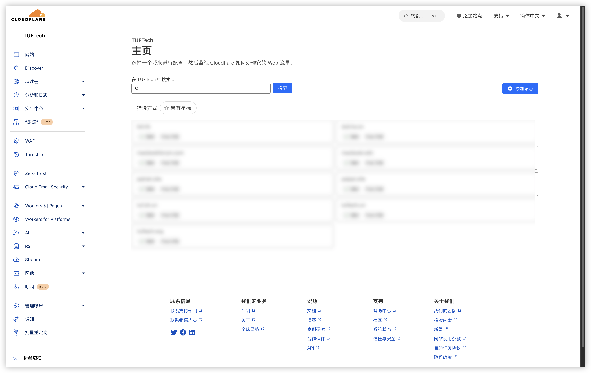

2. 选择左边侧栏的Workers和Pages，点进去


3. 选择左边侧栏的D1，点进去

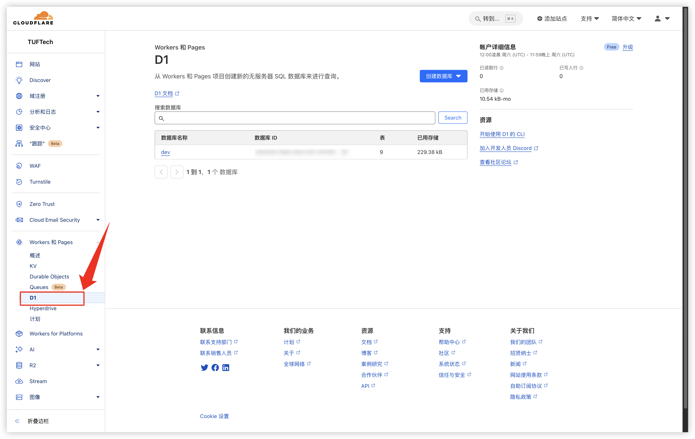

4. 创建数据库，选择仪表盘，名字填dev,然后点击创建

   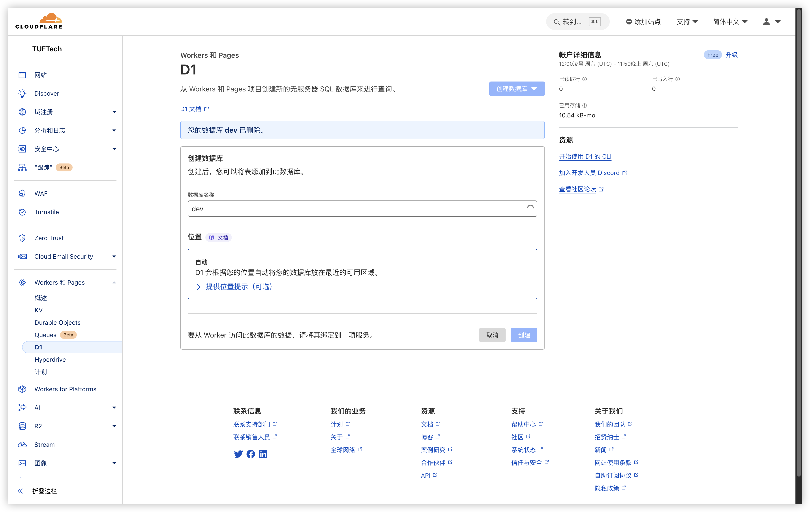

5. 选择控制台

   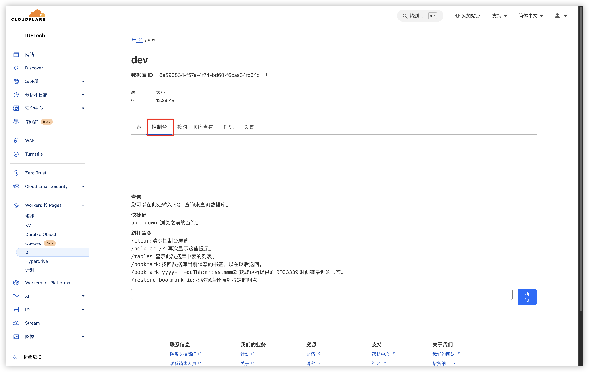

6. 在命令行处输入以下指令，然后执行，出现一下提示说明已经完成

   ```DataBase
   CREATE TABLE IF NOT EXISTS raw_mails (
       id INTEGER PRIMARY KEY,
       message_id TEXT,
       source TEXT,
       address TEXT,
       raw TEXT,
       created_at DATETIME DEFAULT CURRENT_TIMESTAMP
   );
   
   CREATE INDEX IF NOT EXISTS idx_raw_mails_address ON raw_mails(address);
   
   CREATE TABLE IF NOT EXISTS address (
       id INTEGER PRIMARY KEY,
       name TEXT UNIQUE,
       created_at DATETIME DEFAULT CURRENT_TIMESTAMP,
       updated_at DATETIME DEFAULT CURRENT_TIMESTAMP
   );
   
   CREATE INDEX IF NOT EXISTS idx_address_name ON address(name);
   
   CREATE TABLE IF NOT EXISTS auto_reply_mails (
       id INTEGER PRIMARY KEY,
       source_prefix TEXT,
       name TEXT,
       address TEXT UNIQUE,
       subject TEXT,
       message TEXT,
       enabled INTEGER DEFAULT 1,
       created_at DATETIME DEFAULT CURRENT_TIMESTAMP
   );
   
   CREATE INDEX IF NOT EXISTS idx_auto_reply_mails_address ON auto_reply_mails(address);
   
   CREATE TABLE IF NOT EXISTS address_sender (
       id INTEGER PRIMARY KEY,
       address TEXT UNIQUE,
       balance INTEGER DEFAULT 0,
       enabled INTEGER DEFAULT 1,
       created_at DATETIME DEFAULT CURRENT_TIMESTAMP
   );
   
   CREATE INDEX IF NOT EXISTS idx_address_sender_address ON address_sender(address);
   
   CREATE TABLE IF NOT EXISTS sendbox (
       id INTEGER PRIMARY KEY,
       address TEXT,
       raw TEXT,
       created_at DATETIME DEFAULT CURRENT_TIMESTAMP
   );
   
   CREATE INDEX IF NOT EXISTS idx_sendbox_address ON sendbox(address);
   
   CREATE TABLE IF NOT EXISTS settings (
       key TEXT PRIMARY KEY,
       value TEXT,
       created_at DATETIME DEFAULT CURRENT_TIMESTAMP,
       updated_at DATETIME DEFAULT CURRENT_TIMESTAMP
   );
   
   CREATE TABLE IF NOT EXISTS users (
       id INTEGER PRIMARY KEY,
       user_email TEXT UNIQUE NOT NULL,
       password TEXT NOT NULL,
       user_info TEXT,
       created_at DATETIME DEFAULT CURRENT_TIMESTAMP,
       updated_at DATETIME DEFAULT CURRENT_TIMESTAMP
   );
   
   CREATE INDEX IF NOT EXISTS idx_users_user_email ON users(user_email);
   
   CREATE TABLE IF NOT EXISTS users_address (
       id INTEGER PRIMARY KEY,
       user_id INTEGER,
       address_id INTEGER UNIQUE,
       created_at DATETIME DEFAULT CURRENT_TIMESTAMP
   );
   
   CREATE INDEX IF NOT EXISTS idx_users_address_user_id ON users_address(user_id);
   
   CREATE INDEX IF NOT EXISTS idx_users_address_address_id ON users_address(address_id);
   
   CREATE TABLE IF NOT EXISTS user_roles (
       id INTEGER PRIMARY KEY,
       user_id INTEGER UNIQUE NOT NULL,
       role_text TEXT,
       created_at DATETIME DEFAULT CURRENT_TIMESTAMP,
       updated_at DATETIME DEFAULT CURRENT_TIMESTAMP
   );
   
   CREATE INDEX IF NOT EXISTS idx_user_roles_user_id ON user_roles(user_id);
   ```

   指令来源：https://github.com/dreamhunter2333/cloudflare_temp_email/blob/main/db/schema.sql

   

至此D1数据库配置完成

### 后台程序部署

1. 返回Workers和pages，选择创建

   

2. 创建一个Workers，点击创建一个Workers，名字为tmapi，然后点击部署

   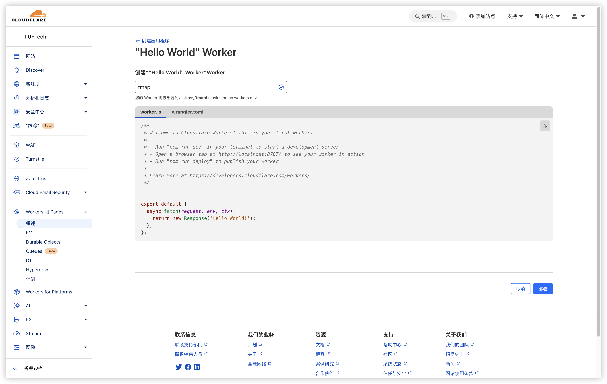

   

3. 在概述页面找到刚刚创建的Worker，点击右上角的编辑代码

   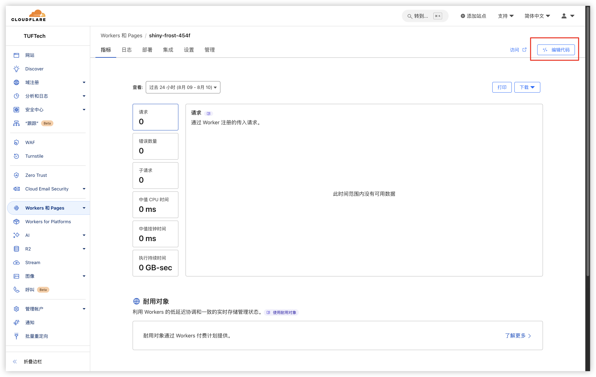

4. 点击左上角的文件夹符号，删除worker.js

   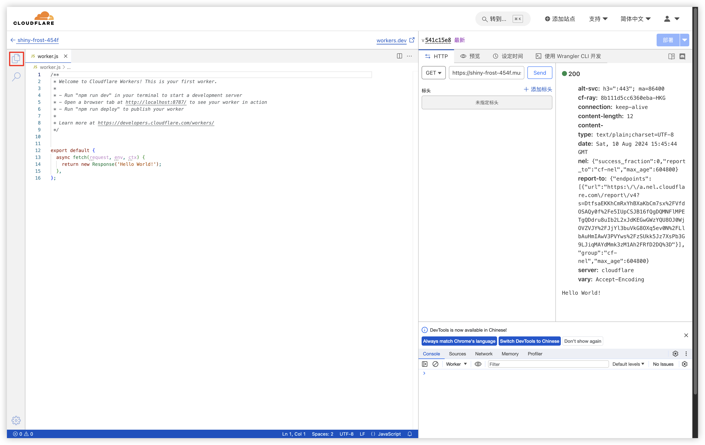

5. 下载这个文件，并且上传，再点击右上角的部署

   ```
   https://github.com/dreamhunter2333/cloudflare_temp_email/releases/latest/download/worker.js
   ```

   
6. 回到最开始的worker界面，点击设置，选择变量，添加以下四个变量，DOMAINS填写顶级域名，然后点击部署

```
ADMIN_PASSWORDS = ["1234"]
PASSWORDS = ["1234"]
DOMAINS = ["b4.hk"]
JWT_SECRET =["xxxyyyzzz"]
```

   

7. 往下滑动，点击下方的KV 命名空间绑定，选择创建，名称填写为temp_mail，点击添加

      


8. 返回Worker，绑定刚刚的KV，变量名称为KV，命名空间为刚刚创建的，然后部署

   

9. 绑定D1数据库，变量名为DB

   

10. 选择触发器，添加自定义后端域(tmapi.b4.hk)

    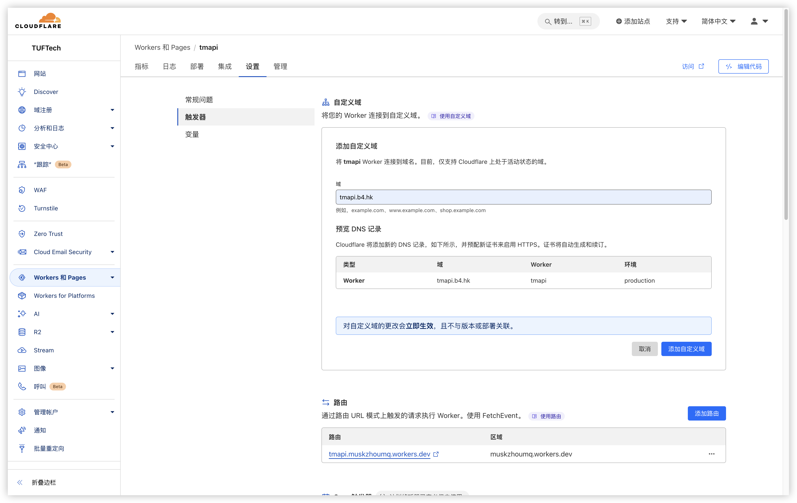

11. 安全检查，分别访问tmapi.b4.hk和tmapi.b4.hk/health_check，返回结构为ok则代表完成。

    

### 前端程序部署

1. 返回Workers和pages点击创建，选择pages

   

2. 生成配置文件，打开作者提供的地址：[配置文件生成](https://temp-mail-docs.awsl.uk/zh/guide/ui/pages)，在这里输入你的后端域名，点击生成，然后下载

   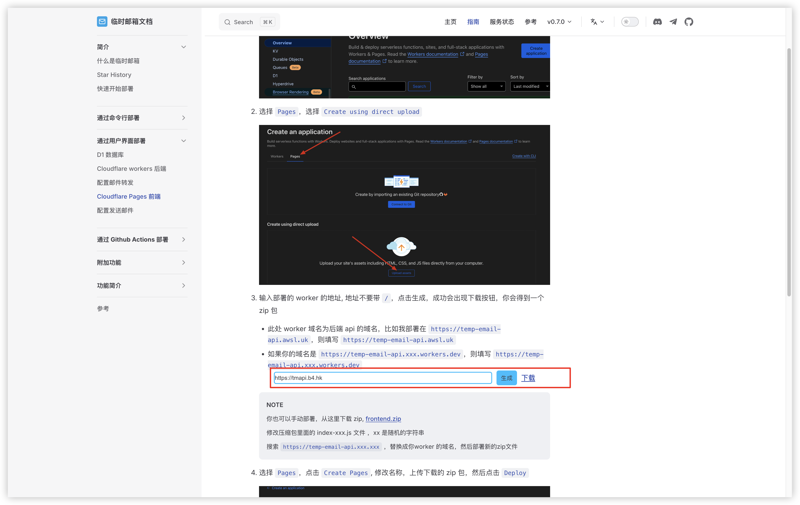

3. 返回刚刚的创建pages，选择上传资产，命名为tempmail，等待压缩包上传完成，选择部署站点

   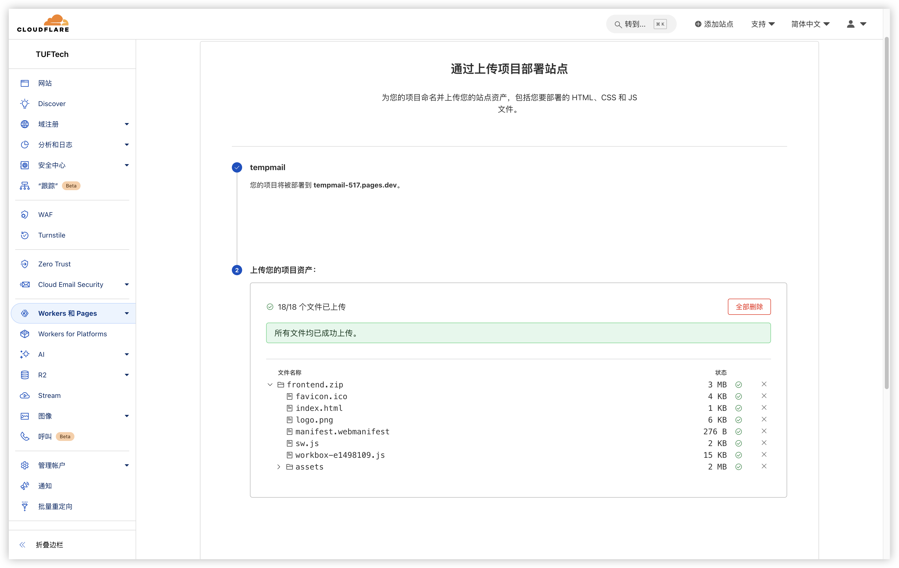

4. 进入项目，点击自定义域，添加自己的前端域(tm.b4.hk)，点击继续，然后激活域

   

5. 访问前端域名，输入密码1234，可以正常进入则代表完成，管理员页面为域名/admin

   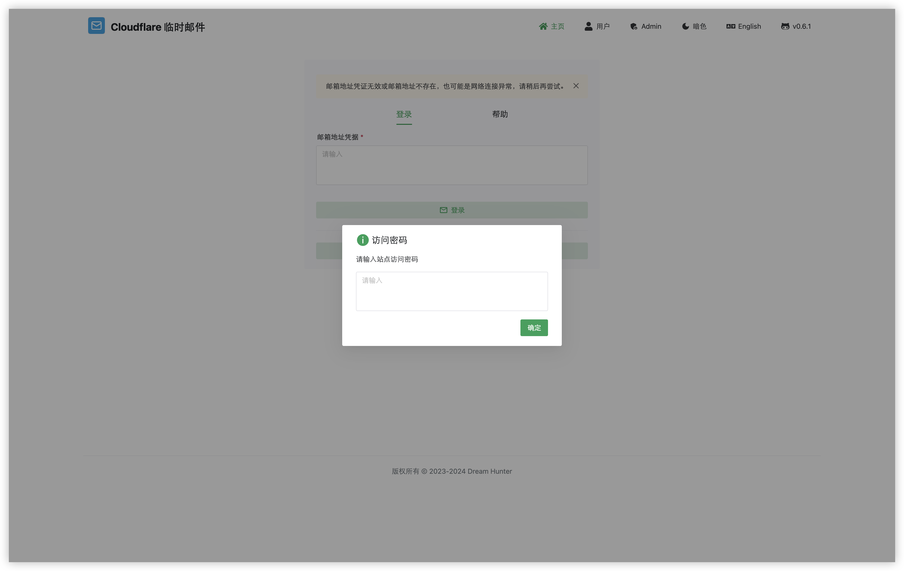

### 邮件设置

1. 进入到你设置的域名，选择左边侧边栏的电子邮件-->电子邮件路由

   

2. 添加DNS记录

   

3. 点击目标地址，验证一个邮箱地址，一般使用自己邮箱就好

   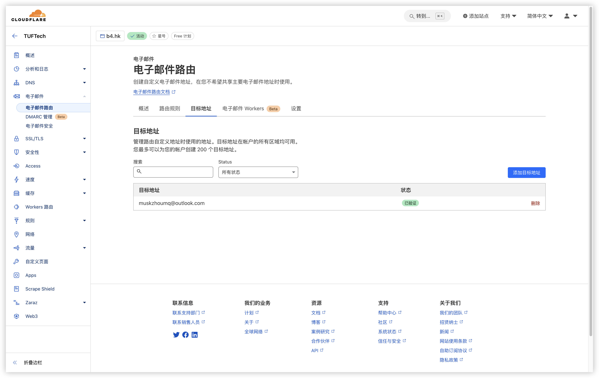

4. 点击路由规则，编辑，将操作改为发动到Worker，选择刚刚创建的后端，保存

   

5. 其用这个规则

   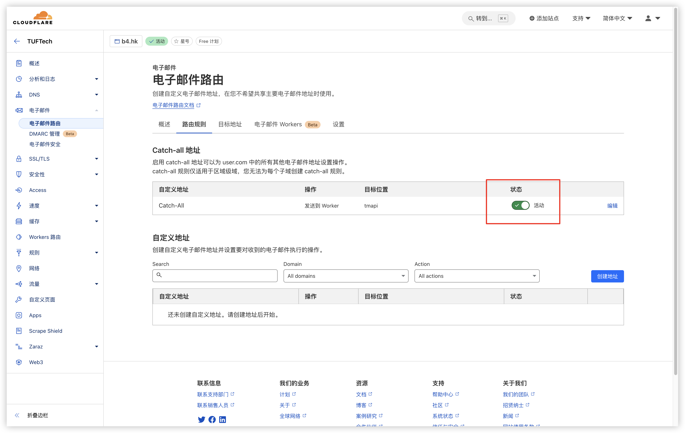

6. 再次访问前端界面，正常访问则代表部署成功

### 发送邮件部署

1. 访问注册https://resend.com

2. 选择Domains

   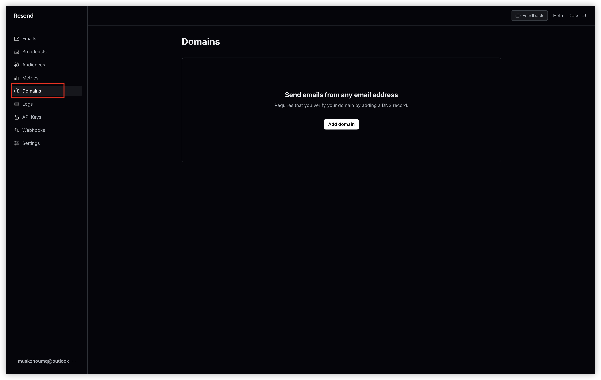

3. 添加domain，并且验证

   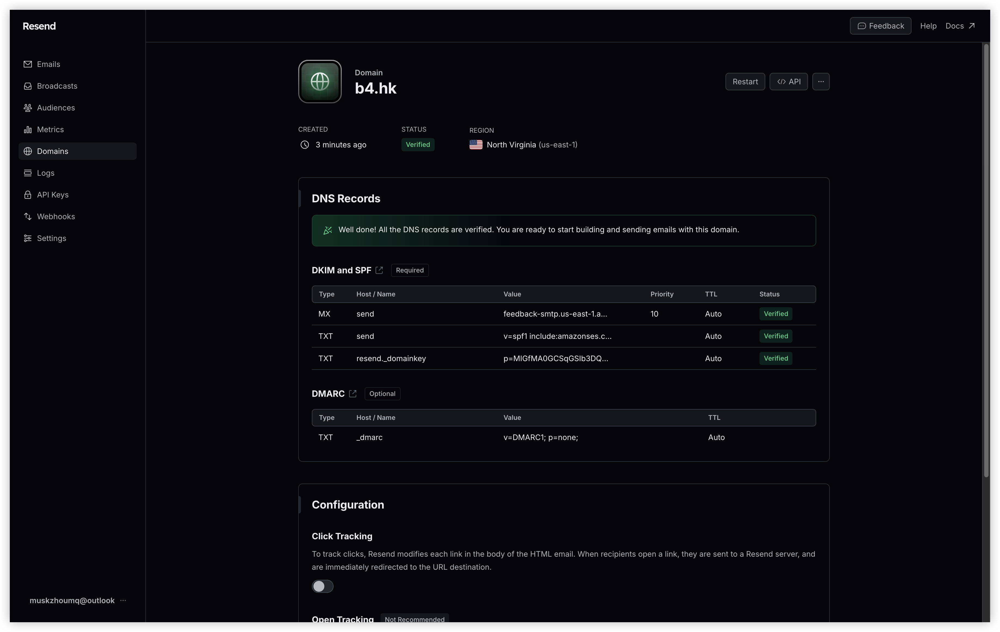

4. 点击旁边的api，创建api密钥，选择全权限，复制密钥

   

5. 回到cloudflare的worker和pages页面，选择后端的worker，进入项目

   

6. 点击设置，选择变量，点击编辑变量，添加变量，部署

```
RESEND_TOKEN = 你的密钥
```

   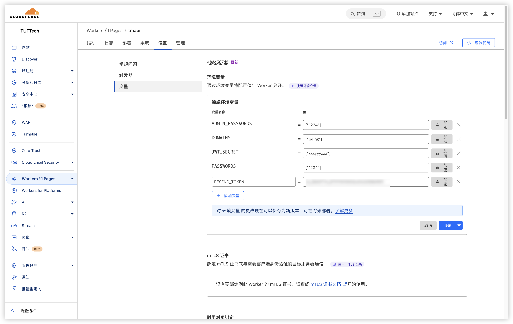

   

### Telegram机器人部署（强烈建议）

1. 创建一个机器人，在tg中搜索@BotFather申请

2. 获取到机器人的token，然后搜索@userinfobot，获取自己的账户id

3. 仿照之前的步骤再次添加变量

```
TELEGRAM_BOT_TOKEN = 机器人token
```

   

4. 打开系统的管理员页面：前端域名/admin，在此处填写你的tg用户id

   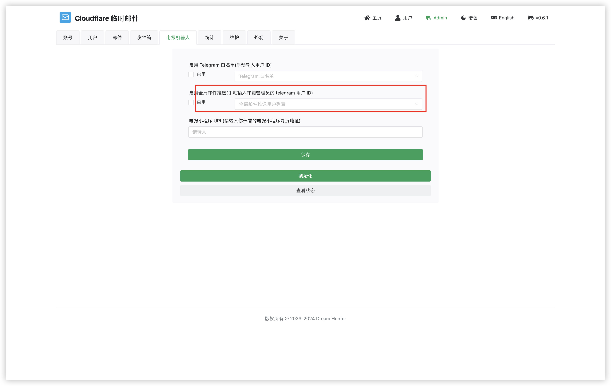

   


**至此所有基础配置完成**


附：所有变量名称及作用，添加方式如之前所示

```
[vars]
# TITLE = "Custom Title" # 自定义网站标题
PREFIX = "tmp" # 要处理的邮箱名称前缀，不需要后缀可配置为空字符串
# 如果你想要你的网站私有，取消下面的注释，并修改密码
# PASSWORDS = ["123", "456"]
# admin 控制台密码, 不配置则不允许访问控制台
# ADMIN_PASSWORDS = ["123", "456"]
# admin 联系方式，不配置则不显示，可配置任意字符串
# ADMIN_CONTACT = "xx@xx.xxx"
DOMAINS = ["xxx.xxx1" , "xxx.xxx2"] # 你的域名, 支持多个域名
JWT_SECRET = "xxx" # 用于生成 jwt 的密钥, jwt 用于给用户登录以及鉴权
BLACK_LIST = "" # 黑名单，用于过滤发件人，逗号分隔
# 是否允许用户创建邮件, 不配置则不允许
ENABLE_USER_CREATE_EMAIL = true
# 允许用户删除邮件, 不配置则不允许
ENABLE_USER_DELETE_EMAIL = true
# 允许自动回复邮件
ENABLE_AUTO_REPLY = false
# 是否启用 webhook
# ENABLE_WEBHOOK = true
# 前端界面页脚文本
# COPYRIGHT = "Dream Hunter"
# 默认发送邮件余额，如果不设置，将为 0
# DEFAULT_SEND_BALANCE = 1
# Turnstile 人机验证配置
# CF_TURNSTILE_SITE_KEY = ""
# CF_TURNSTILE_SECRET_KEY = ""
# dkim config
# DKIM_SELECTOR = "mailchannels" # 参考 DKIM 部分 mailchannels._domainkey 的 mailchannels
# DKIM_PRIVATE_KEY = "" # 参考 DKIM 部分 priv_key.txt 的内容
# telegram bot 最多绑定邮箱数量
# TG_MAX_ACCOUNTS = 5
# 全局转发地址列表，如果不配置则不启用，启用后所有邮件都会转发到列表中的地址
# FORWARD_ADDRESS_LIST = ["xxx@xxx.com"]
```

