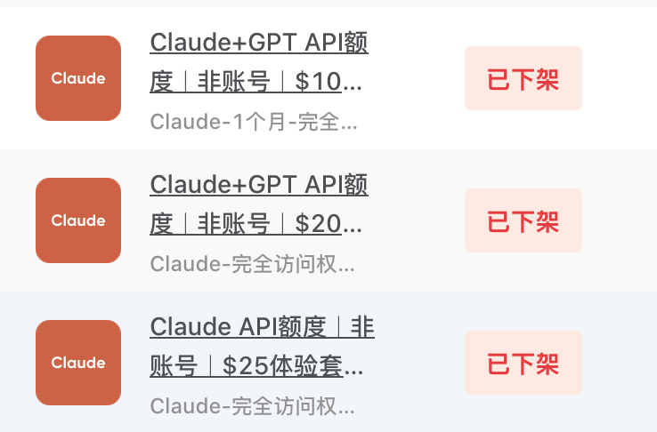
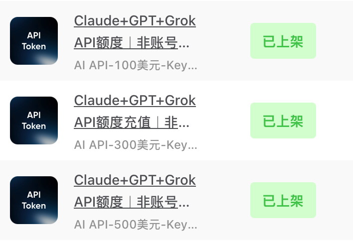
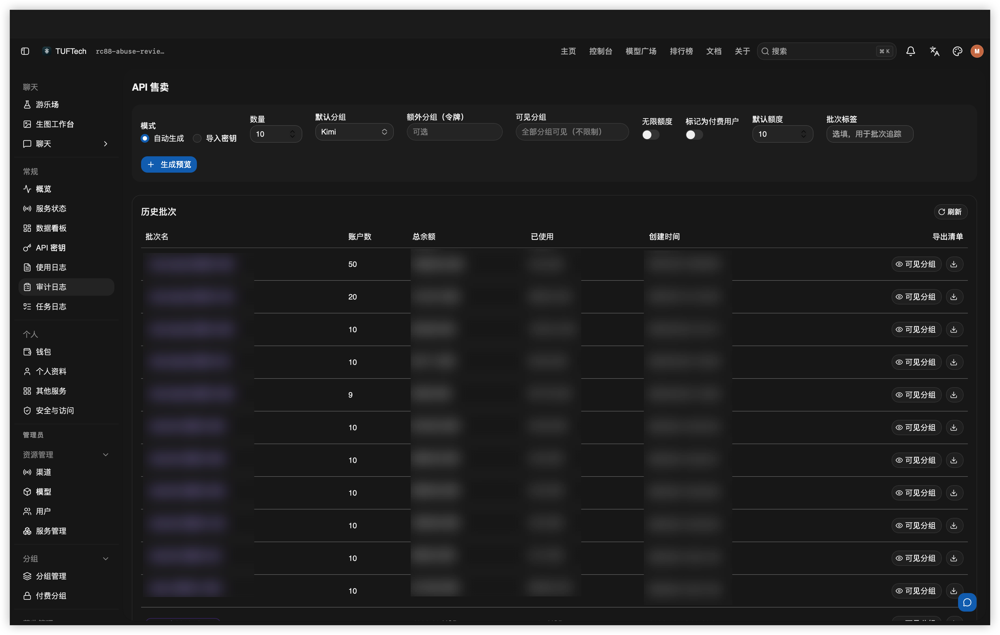
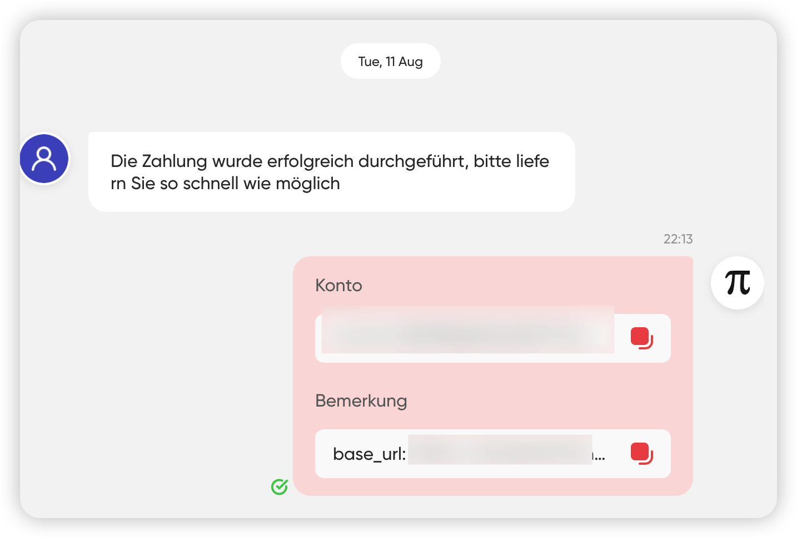
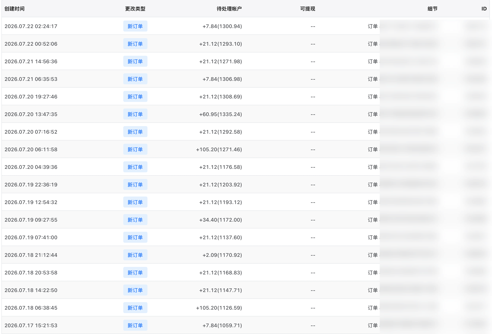
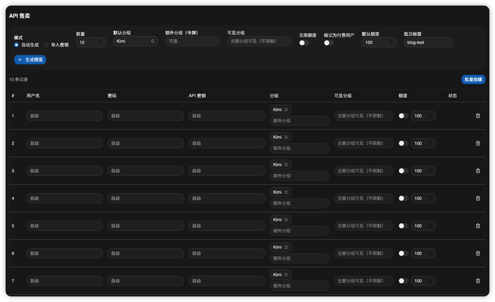
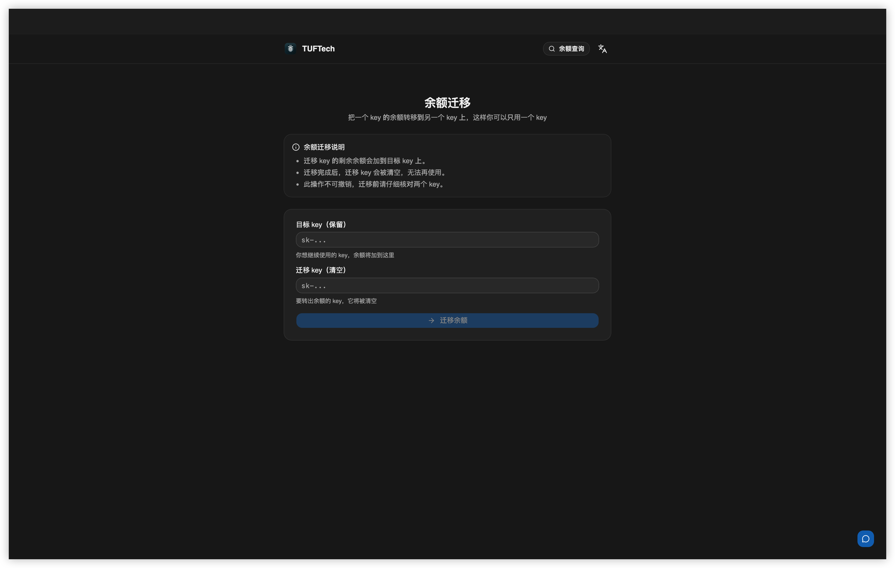
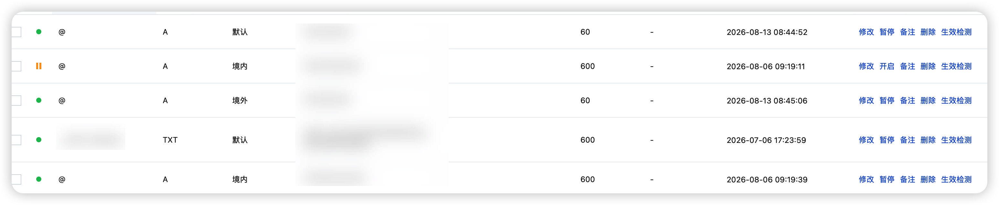
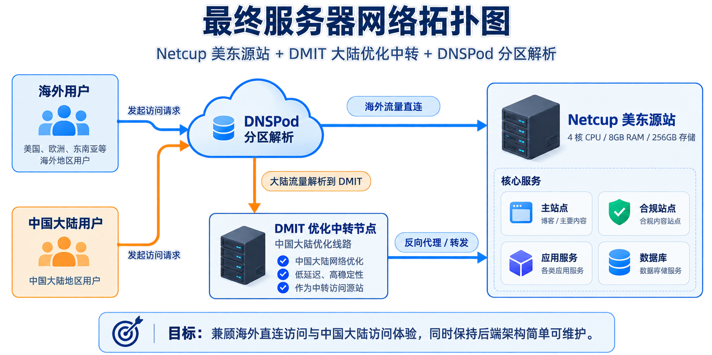

> [!NOTE] 前言部分
>
> 关于我：2025级在校大学生，现在大二，就读于机械电子工程专业。在真正决定开始运营我的中转站的前三个月，我其实已经在一家中转站公司进行实习，主要是做一些技术支持、系统开发一类的工作。并且也有在做自己的项目开发。但是6月份的我实在是有点不甘于只在别人的中转站做客服，于是我决定尝试自己也运营一次。
>
> 在这短短的三个月中，我面临了比如跨时区的客户支持、中转站程序二次开发、渠道管理以及平台合规之类的等等问题。虽然这其中大部分问题对我来说并不是什么无法解决的难题，但是大部分也确实消耗了50%的精力，尤其是需要熬夜回答客户消息和系统维护的时候。但是好在最终的结果是好的，在三个月中，我不敢说我是全职在做，因为我没有进行任何的推广，我仅仅是有客户消息的时候回复一下，以及需要更新系统的时候进行一下维护。在这种兼职的情况之下，三个月我的中转站营业额约为 **4500美金**（不包括国内营业额）。当我回看这个金额的时候还是比较欣慰和开心的，这尤其为我8月的出行提供了大量的资金。

> [!WARNING]
> 本文仅记录和分享个人经历，不做任何赚钱教程亦或者入行建议

## 第一章：六月，怎么开始的？

### 1.1 一次实习带来的想法

其实在我正式开始运营一家中转站之前，我就已经在一家专门经营中转站的公司实习，在这家公司里面我经历了许多许多的客户维护的工作。除此之外也会包含一些系统开发和社群维护的工作。

这一段实习差不多持续了3个月左右的时间，在这段时间里我也学会了很多客户维护的相关经验，以及例如文档撰写和开一个中转站会遇到的常见问题的解决办法。所以对于我来说进入中转站这个行业，并非一次完全没经历过的探索，而是一次拓展和尝试

### 1.2 开始这门生意的理由

对于我来说其实这门生意并没有那么重要，因为我还是一名大学生，我不需要依靠这份工作去养活自己，也不需要赚到多少多少钱才可以去做什么事情。

让我开启这次探索的其实仅仅来源于我个人的兴趣，我想去验证自己是否具有独立经营一门生意的能力和决心。除此之外，也包含着我对于这个行业的好奇和对于ai技术的热爱。所以这次的运营对我来说仅是一次商业实验罢了，于是我在刚开始的时候也并没有为自己定下什么宏远或者伟大的多少多少营业额的创业目标。

当然除此之外，其实还有一个比较现实的原因：我在八月份计划前往云南旅游，虽说我有父母的支持，但是我本身就只是兼职在空闲时间运营这个中转站，能多攒一点钱出行，也是为旅行增添一份享受了

### 1.3 开始之前拥有什么

- 在入行之前，我就在实习工作中积累了对整个API中转行业的基本的认识，包括他的运转逻辑、定价逻辑、进货渠道和配置等等等等
- 当然除此之外，我从初三的时候便拥有了自己的服务器，并且开始了开发和运维的学习和实践，所以独立运营中转站的服务器运维和中转站程序的二开工作对我来说都可以在AI的辅助之下轻松完成，这也大大的降低了我的程序迭代周期和开发成本

---

## 第二章：把 API 变成商品，第一批客户从哪里来

### 2.1 关于我的售卖平台选择

我想所有做过C端客户的都知道，拉新客户和做推广是一件非常困难、复杂和艰难的过程。有的客户抱着白嫖的决心，注册多个账号薅羊毛；有的客户会出现各种问题，支付问题、技术问题等等等等。

我本身并不愿意将过多的精力放在这些事情上面，所以我选择了一个受制于人但是更便捷的方法——我直接找了一个类似闲鱼的现场平台进行售卖。

选择这种平台的原因很简单：

- 一个是我不需要去折腾各种境外收款的工具
- 二是我不需要做任何的推广，我只需要做好客户体验和商品定价

于是我开始在这个平台尝试售卖。

其实这个平台做的并非专业的api售卖，在我刚开始的时候他们也并不售卖api产品，而是类似共享订阅或者代订阅的服务。但是我在和他们的平台经理进行了一番讨论和沟通之后，他们决定在claude订阅的大类中添加api这个选项，而我作为推动这个品类的人，也自然成为了第一个吃螃蟹的人，第一批在这个平台售卖api的商家。

前：后：

### 2.2 我如何发货的

得利于平台的商品类型的发货，帮我省去了很多的告诉用户如何创建密钥和密钥的倍率都是什么意思的过程。我可以直接将对应额度的api密钥发货给用户，他只需要在自己的客户端配置密钥就好。

为此，我专门给我的程序开发了一个批量创建用户和api密钥的功能，专门用来批量创建用户以及用户名下的api密钥，这样既避免了直接售卖api密钥无法准确定位到单个用户的麻烦，也省去了我手动创建用户和密钥的麻烦。

<small><em>批量创建用户和api密钥</em></small>

有了这个二开的功能，我需要做的就非常的简单了。我将创建的用户和对应的密钥导出之后，下载这些信息，然后提取出里面的密钥，将他复制到平台批量补货的格式文件里面，然后再将这个格式文档上传到平台的自动发货系统。这样用户就可以在下单之后立刻收到完整的使用信息，无需人工操作或者人工审核。

<small><em>平台的自动发货系统</em></small>

除了发货需要的api密钥之外，我会在备注当中补充说明使用我们服务所需要的baseurl请求地址，以及一些简短的使用指南和建议。并且在后期，我也逐渐加上了好评返利等促销活动的消息。例如：*base_url: https://api.example.com. Thank you for your purchase! You can check your API Key balance and transfer credits between Keys anytime on https://api.example.com. After completing a real-world test, submit a genuine review to receive an additional $10 in credit. Thanks for your support!*

### 2.3 第一批客户与增长

由于我是第一批开始售卖API密钥的，所以最初和我竞争的商家并不多，只有极少数的同类商家。

所以我的第一批客户源自于抢占市场先机，相较于别的商家，我们的产品规模和类型更为整齐和丰富，在别的商家定价的额度层次不齐的时候我们定下来50美金 100美金 200美金 500美金和1000美金5个额度阶梯和他们对应的价格，这也大幅提升了客户对我们的信赖程度。

在后续的售卖当中，我们也依托平台的曝光以及我们自身积累的客户评价，在留住和优化老客户体验的同时，不断拓展客户。在整个7月当中，我的收入是 **2201.5美金**。

此类直接在平台上进行售卖的方式，为我这种个人商家以及没有独立营销团队的小商家解决了早期获客的问题，但是问题也逐渐浮出水面，那就是对于平台的依赖，以及很多售后行为受制于平台规则，并且需要承担平台跑路的风险和体现手续费之类的隐性成本。

---

## 第三章：为了卖 API，我把中转站改成了另一种产品

### 3.1 现成的程序并不等于现成的生意

目前市面上有两个主流的API中转站开源程序，Sub2Api以及Newapi。然而，这两个程序都只是最基础的，为了让所有人都能直接开箱即用的，这就意味着他的功能不可能满足所有人的需求，例如我的需求他就无法满足，所以我选择以newAPI作为基底，在它的基础上去二次开发，使其满足我的固定额度、自动交付、面向 C 端的商品模式。

所以我才在后期的运营过程中不断寻找需求痛点，并且设计交互流程和具体逻辑，然后再在Ai的辅助之下，对我的程序进行改进和二次开发。

### 3.2  ex.1 批量创建用户与 API Key

由于我选择的平台采取售卖的商业模式，我就需要摒弃在常规中转站的用多少充多少的充值模式，转而卖类似国内三大运营商最喜欢的流量包的形式，也就是卖固定额度的额度包。

我开发了批量创建用户的功能，我只需要设置创建用户的数量，他的默认分组，可见分组以及这个用户的额度，并且给这一批次打上标签，就可以直接进行创建。然后再下载包含信息的csv文件，并导入到平台的自动发货系统，这就完成了一次简单的补货，通过这一类的程序，大大的减轻了我的人工工作了，将原本重复的人工操作转换成批处理工作。

<small><em>批量创建用户的功能</em></small>

### 3.3 ex.2 余额迁移：解决重复购买的问题

但是这种模式之下也暴露出一个弊端，那就是老用户在找我反复购买额度包的时候，每次发给他们的都是一个满额度但是全新的账户和API，这对于在多个编码器里面使用我们服务的客户不得不在每次购买之后，对自己的key全部进行一次轮换。

在一次用户的反馈当中，我马上也注意到了这个问题，于是我开发了这个余额迁移的功能，这样用户只需要提供新的key和目标key，就可以将他们新买的key的额度转移到他们正在用key当中。

<small><em>余额迁移的功能</em></small>

所以我觉得，在真实的开发当中，最重要的反而不是作出多炫酷的功能或者多完善的逻辑，而是找到可以真正解决用户痛点的功能，并且将它不断的简化和优化，提升用户体验。

### 3.4 ex.3 渠道故障时的自动路由

这一点的更新和改进，其实也是主要集中在提升客户体验，由于各个渠道的使用感受、稳定性和可用模型列表的不同，导致有时候用户的请求会从A渠道转到B渠道去继续处理。

但是成品中转站程序的转发和路由逻辑太过简单，导致有时候可能某个渠道的突发故障，会被传到用户的视角当中，这就导致，可能某些简单重试就能恢复，部分用户仍然会因此停止使用并联系客服。于是我优化了渠道自动切换和路由逻辑，希望尽量减少用户直接感知到的报错。

### 3.5 AI在开发中的作用

由于我就一个人运营着整个中转站，上述所有功能的开发也全部依赖我一个人，在实际的编码过程中主要依靠Ai辅助。那么这个过程中，即使AI可以完成大部分的编码任务，但是我依旧需要进行人工的功能测试和bug调试。

并且在整个开发的流程中，我会要求AI尽可能的去学习和仿照程序作者的开发方法和习惯，以及整个程序的大体框架，这样即使我们要把我们的二开版本和官方后期的更新版本作合并，也不会过于复杂。

同时，为了避免修改的程序影响到我们实际的生产数据库，也为了避免bug影响到用户体验，我有一套严格从开发到验证再到测试再到实际上线的流程。

1. 我会先在本地进行开发，在开发完成后在本机的模拟数据库上进行测试
2. 这一步完成后，就推送到云端进行构建测试
3. 在构建完成后，我会现在我的demo站点进行测试，demo站点的数据库是从生产库直接复制过来的，每30s同步一次，这样确保不会影响到现有客户
4. 在demo站点测试完成没问题后，我才会开始着手写更新公告和正式部署

---

## 第四章：从一台服务器到跨区域部署，我踩过的架构坑

### 4.1 最初的基础设施

最初我的想法很简单，因为只是一次简单的商业实验，我没有准备什么特别好的配置特别高的服务器，只是简单的购买了一台腾讯云的硅谷服务器，配置是2C4G+70G的存储。

在最开始的是，这台服务器还能正常运行，性能完全足够，但是随着用户的增加，站点的部署以及增多的并发请求。我的服务器带宽首先告急了，开始有用户反馈速度很慢，容易断开连接，于是我意识到这个服务器已经不够了

### 4.2 第一次尝试：跨地域部署

由于是国外平台，我的客户遍布全球各地，有来自德国的，巴西、韩国和印度的。这几个地区放到一块，我一下子就想到了美洲地区，欧洲地区和亚太地区三大地域，于是我不假思索的购入了日本、德国和美东的三台服务器，三台服务器分别承担亚太、欧洲和美洲地区的请求。

然而，不假思索的行为最终被证明是不靠谱的，在实际的部署实践当中，我发现了一个致命的问题——由于不可避免的地理距离，这三台服务器之间的延迟达到了 **200-300ms**，这可能对于日常的浏览网页并无大碍，但是在数据库的读写当中埋下了大雷，于是我当机立断，将所有的部署全部回退到了单独一台服务器部署。

### 4.3 最终方案：高配置源站 + 优化线路中转

我的第二个方案选择了一个更为简单却完善的方案：

- 我选择第一次方案中的美东服务器作为我中转站的新服务器，4C8G的配置再加256G的存储，足够我接下来长时间的业务发展
- 与此同时，我还新购买了一台DMIT的美西服务器，用于提供中国大陆方向的优化线路。这样解决了在中国大陆访问和请求网站延迟过高的问题
- 而来自国外的请求依旧是直接对我们的美东源站进行请求

为了达成如上的效果，我购买了腾讯云的DNSPod服务，这是一种根据不同的请求ip设置不同解析地址的功能。

<small><em>根据不同的请求ip设置不同解析地址</em></small>

<small><em>服务器网络拓扑与流量架构图</em></small>

---

## 第五章：真正麻烦的不是写代码，而是持续经营

### 5.1 上游渠道质量参差不齐

这是我在运营的过程中感觉最麻烦的一个问题，由于中转站行业本身的不稳定性，导致很多渠道商可能突然没法供应某个模型，或者跑路，我就得紧急去使用别的渠道补上，在整个三个月的运营中，我寻找了 **超过50家** 上游供应商。

但是这也产生了另一个问题，这50家里面，有的用的多有的用的少，但是我的总共的资金是固定的，我要想要每个供应商都有，那我每个供应商都要充值，但是如果把我手里的资金全部充值进去，某个最常用的渠道余额不足的时候，我就没法快速补上。

所以我只能不断的评估和测试，在实际的使用和体验中，最终确定了 **5家以内** 的供应商，不仅减少了维护的经历，也集中了我的资金。

### 5.2 定价、利润与客户维护

不同的渠道意味着不同的价格，但是我们不能将这个成本转嫁到消费者身上，所以我们在定价的时候既需要考虑最贵的渠道，也需要考虑到便宜的渠道。

为了我们的利润，我在程序的渠道选择当中加了一个参考项，成本倍率。比如说，同样的A模型，从A渠道进货是官方价格的0.2倍，但是B渠道只要0.1倍，那用户请求A模型就会默认先请求B渠道。这样不仅优化了请求结果，也降低了我们的成本。

除了渠道的成本外，我们还额外参考了平台的普遍定价水平和额度，并且将平台的提现手续费和用户的好评返现一并算入成本。比如我们售卖的100美金套餐

| 额度    | 售价     | 返现额度 | 渠道成本 | 商家抽成23.99%+0.49$ | 最终收入 | 最终利润 |
| ------- | -------- | -------- | -------- | -------------------- | -------- | -------- |
| 100美金 | 9.99美金 | 10美刀   | 30人民币 | 2.89美金             | 48人民币 | 18人民币 |

<small>注：商品中的 100 美元是按站内计费规则计算的 API 额度，不是等同于 100 美元现金</small>

### 5.3 海外 C 端客户的售后问题

由于平台的限制的原因，导致我在做售后和技术帮助的时候十分的麻烦，因为我没法想做国内客户一样让他们安装一个todesk，然后发一个远程的操控链接过来，我在直接帮助他们完成所有的配置。

我只能靠着让客户发截图，然后一条有一条的跑测试的指令，还有让他们会发问题，来抽丝剥茧般的寻找问题的根源所在。尤其是当遇到一些不是程序员出身的客户的时候，这个过程变得更加的麻烦。为此我还特意写了多份文档来帮助他们配置。

除此之外，由于客户的所在地来自全球，导致可能到了凌晨一两点我还需要回复客户消息，虽然说整个流程我已经尽可能的做的全自动了，但是免不了会有一些比较难搞的客户，这或许也是做国外客户的弊端之后，我不得不去牺牲睡眠时间来维护客户。

---

## 第六章：三个月结束，我到底赚了多少钱

### 6.1 启动成本与支出

我将成本分为了三大类：

- 首先是硬件成本，也就是我的服务器的钱
- 其次是渠道成本，也就是我付给上游渠道的钱
- 最后是一些杂项，比如说域名费用，DNSPod会员服务之类的

我们首先来看硬件成本，我总共在过程中购买了6台服务器，但是其中的第一次的尝试的服务器我都进行了退款，那么实际上我只购买了3台服务器。

| 服务商 | 型号             | 配置      | 价格      | 周期 |
| ------ | ---------------- | :-------- | --------- | ---- |
| NetCup | VPS 1000         | 4C8G 256G | 11.56欧元 | 月   |
| DMIT   | LAX.AS3.Pro.TINY | 1C2G 20G  | 10.9美元  | 月   |
| 腾讯云 | 清凉型服务器     | 2C4G 70G  | 199人民币 | 年   |
| **总成本** |             |           | **528.48** |     |

其次我们来看一下渠道成本，我们按照不同的模型来统计

| 模型厂家           | 总渠道数 | 总金额 |
| ------------------ | -------- | ------ |
| claude             | 4        | 4560   |
| Gpt                | 1        | 290    |
| 国产模型           | 1        | 200    |
| 最终没有选用的渠道 | n        | 1000   |
| **总成本**         |          | **6050** |

最后我们来看一下各种杂项

| 类型         | 费用 | 周期 |
| ------------ | ---- | ---- |
| 域名三个     | 230  | 年   |
| 腾讯云DNSPod | 99   | 年   |
| **总成本**   | **329** |   |

那么我们最终的总成本来到了6907.48人民币，当然过程中肯定还有许多被我无意忽略了的成本，所以将我们的总成本定为 **7500人民币**

### 6.2 真实的经营结果

我们最终的总的营业曰为4500美元也就是三万出头人民币，对于我来说，还是比较满意的

| 月份 | 金额    | 订单数量 | 人民币   |
| ---- | ------- | -------- | -------- |
| 6月  | 1482.56 | 94       | 9930.93  |
| 7月  | 2201.5  | 108      | 14746.75 |
| 8月  | 827.1   | 50       | 5540.33  |
| 9月  | 467.12  | 36       | 3129     |

### 6.3 这门生意值不值得做

我觉得整体来讲，只要有足够的资源，足够的资金和耐心的情况下，这门生意是可以去做的，但是现在的入行成本确实比我当时入行的时候要高出不少，我当时入行其实并没有特地准备一笔多少多少自己，可能储备用来做这个的资金也就一两千块。最终能赚到3w多块钱是我当时没有预料到的。

---

## 第七章：结语——一场三个月的商业实验

回头再看这三个月，其实我一开始也没有想到，自己随手尝试的一门小生意，最后真的能给我带来几千美金的收入。对于我来说，这次尝试最大的收获当然是赚到了钱。毕竟从一开始，我就没有打算把它包装成一件多么伟大的创业项目。我只是恰好对这个行业感兴趣，之前也有过相关的工作经历，觉得自己有能力独立把这件事情做好，于是就真的去试了一次。

不过在这三个月里，我也确实接触到了许多过去作为实习生不需要考虑的问题。从服务器的选购与架构调整，到上游渠道的采购、模型价格的制定，再到程序的二次开发、平台合规和客户售后，这些事情最终都需要我自己去处理。

很多问题其实并没有那么难解决，但当所有问题都需要由自己负责的时候，事情就变得不太一样了。

如果问我这门生意值不值得做，我觉得很难给出一个适用于所有人的答案。我能够获得这样的结果，一部分来自过去积累的技术经验，另一部分也确实得益于当时的平台环境和市场机会。如果换一个时间、换一个平台重新开始，我也不敢保证能够取得同样的结果。

而且，这份收入并不是完全没有代价的。除了服务器、渠道和手续费，还有大量没有记录在账本上的时间成本。尤其是渠道出现故障，或者半夜需要处理客户问题的时候，我也会觉得挺麻烦的。

但不管怎么说，至少对于我自己而言，这仍然是一次结果不错的尝试。它让我有机会真正独立地运营一项业务，也让我在实际经营中接触到了许多单纯写代码时不会遇到的问题。

这篇文章就先记录到这里。以后如果有时间，我也会继续分享自己在 AI API、独立开发、服务器运维以及其他个人项目上的一些经历和实践。感谢你看到这里，也欢迎有相似经历或者对这些事情感兴趣的朋友一起交流。
