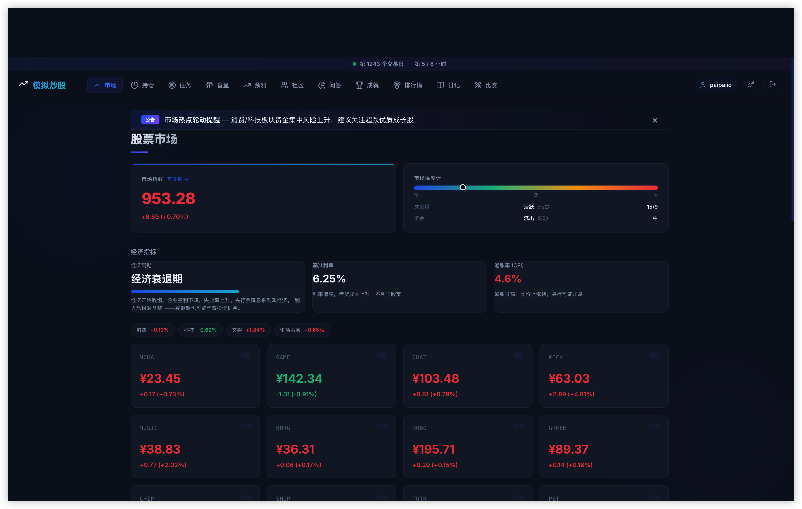
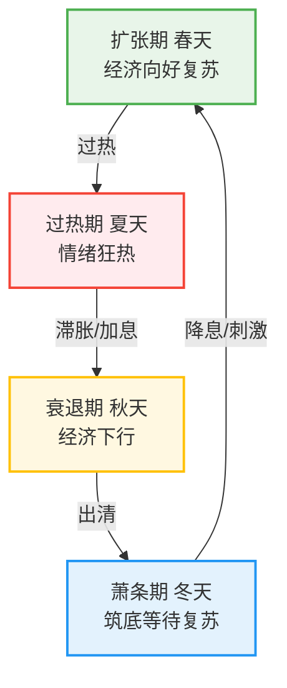

# 重塑金融教培基础设施：基于 DeepSeek AI 驱动的全仿真模拟股市系统架构解析

在现代金融教育、量化策略启蒙以及商业财商培训中，传统的模拟交易平台往往只能提供一个静态的、规则死板的“沙盒”。这类系统缺乏真实二级市场的复杂博弈属性，难以让受训者体验到流动性危机、情绪周期以及机构博弈带来的真实市场冲击。

为突破这一瓶颈，我们自主研发了下一代**全仿真模拟股市教学系统** 。该系统不仅仅是一个交易撮合引擎，更是通过深度集成大语言模型（DeepSeek API）构建的复杂自适应系统（Complex Adaptive System） 。它能够在零风险的环境下，完美映射真实金融市场的高阶动态特征。

## 一、 严密的微观市场结构与宏观周期建模

本系统在底层交易逻辑上严格遵循现代金融市场规范，构建了一个极具深度的虚拟经济体。

### 1. 资产标的与交易机制复刻

系统内置了覆盖消费、科技、娱乐、生活四大核心板块的 24 至 25 只虚拟股票 。不同资产不仅拥有独立的波动率（0.3~0.85）与基本面评分，还内置了严密的供应链传导逻辑 。例如，上游“芯片大师”的利好政策，会通过底层算法直接传导至下游的“未来机器人”与“电动未来” 。

在交易规则上，系统支持高度拟真的市场微观结构：

* 
**T+1 交易制度与时间标度**：系统将现实交易日压缩，约每 2 分钟为一个完整的交易日（包含 120 个 tick），交易日之间穿插 60 秒的休市倒计时，用于受训者进行复盘与策略调整 。

* 
**高阶挂单与做空机制**：除市价买卖外，支持限价单、止损单与止盈单 。同时开放了做空机制，要求缴纳 1.5 倍至 2 倍的保证金，并每日计提借券费，当亏损达到阈值时将触发无情的强制平仓引擎 。

* 
**市场摩擦与通胀侵蚀**：完美的投资模型必须考量摩擦成本。系统引入了阶梯式交易手续费（0.15% 至 1.5%）、按持有天数递减的资本利得税模型 ，以及每日扣减的通胀摩擦费率 ，逼迫玩家克服“持币观望”的惰性。

### 2. 宏观经济周期与事件驱动

市场绝非线性发展。系统内置了宏观经济周期轮转引擎，市场会在扩张期（春）、过热期（夏）、衰退期（秋）与萧条期（冬）四大阶段中自动循环 。此外，“黑天鹅事件”生成器会随机投放市场崩盘、特别分红、股票拆分或技术突破等极端事件，全方位考验受训者的风控能力 。

## 二、 核心壁垒：12 个 AI 智能子模块构成的“市场大脑”

市面上绝大多数产品依赖预设的随机脚本，而本系统的灵魂在于其深度集成了基于 DeepSeek API 的 12 个独立 AI 子模块，实现了真正意义上的“AI 驱动市场” 。

### 1. 异质化 AI 机构博弈引擎

市场由多方资金共同塑造。系统生成了三个风格迥异的虚拟机构投资者，它们拥有独立的资金池，在盘中与人类玩家展开博弈 ：

* 
**稳健资本（价值型）**：锚定 PE 与利润率，在资产被低估时执行左侧建仓 。

* 
**星辰基金（成长型）**：追逐高成长与热点，推波助澜制造市场主升浪 。

* 
**逆风投资（逆向型）**：在市场狂热时抛售，在恐慌崩盘时接盘，扮演市场的缓冲器 。

### 2. 动态自适应的 AI 新闻与做市机制

* **AI 实时新闻叙事**：系统储备了过百种新闻模板，AI 引擎能够根据当前公司基本面与大盘状态，每隔 60~180 秒自动生成财经新闻 。这些新闻带有 -15% 至 +15% 的量化情绪影响值，并能触发同板块的跟随性链式反应 。

* **量化流动性管理与庄家操控**：系统模拟了主力资金吸筹、洗盘、拉升、出货的完整生命周期 。同时，“AI 做市商”与“AI 公平监控”模块会实时巡查盘面，当出现价差过大或严重单边走势时，自动施加反向压力或提供流动性，维持市场的微观稳定 。

## 三、 行为金融学干预与游戏化激励机制

优秀的教学系统不仅需要专业的底层架构，还需要卓越的用户留存与心智引导设计。

> “真正的投资大师也经常亏钱，重要的是从中学到东西。” 

* 
**个性化行为分析与矫正**：AI 引擎持续追踪受训者的交易轨迹，精准捕捉“追涨杀跌”、“过度集中持仓”等非理性行为，并以友善的投教简报形式推送改进建议 。

* 
**成长体系与成就图谱**：系统构建了从“实习生”到“传奇投资家”的 10 级经验体系 。完成每日任务或达成特定交易条件即可解锁诸如“初尝甜头”、“钻石手”（持仓超 5 个交易日）、甚至“交学费了”（首次亏损卖出）等 14 种社交徽章 。

* 
**多元化博弈玩法**：引入预测系统（竞猜个股或板块涨跌）与盲盒抽取系统（铜、银、金三档，附带锁定期限机制防止恶意套现），极大丰富了系统的互动维度。

## 四、 工业级底层架构与安全保障

为保障高并发下的数据一致性与操作安全，本系统在技术选型上毫不妥协：

* 采用 WebSocket 提供 1秒/tick 的无延迟行情推送 。

* 核心交易状态与引擎数据定时持久化至 MySQL，支持服务器重启后的自动恢复与管理员级别的一键快照回滚操作 。

* 采用 JWT 鉴权体系、bcrypt 密码加密与完整的 IP 限流防刷机制 。

## 五、 商业授权与应用场景

无论您是高校经济学实验室、学生社团（如模拟联合国经济分会），还是寻求高转化率的商业财商教育机构，本系统都能为您提供开箱即用的专业级赋能。

系统支持独立服务器部署，并开放完整的管理员总控后台，支持“全自动运转”或“人工干预审批”模式。我们提供以下两种授权方案：

| 授权版本       | 价格           | 适用场景及核心权益                                           |
| -------------- | -------------- | ------------------------------------------------------------ |
| **学术教学版** | **¥200 / 次**  | 适用于非营利高校实验课、学生社团内部赛。包含完整的全仿真市场机制与基础 AI 投教引擎，支持基础赛事创建与排行榜功能。 |
| **商业运营版** | **¥1500 / 次** | 适用于商业财商培训、大型公费赛事、企业内训。无限制高并发用户承载，开放深度 AI 参数配置、高级博弈引擎调节权限及自定义商业皮肤。 |

*获取部署方案或预约系统在线演示，请联系开发者获取支持。

## 六、 获取授权与联系方式

本系统由 **paipaiNetWork** 独立研发并提供长期技术支持 。如果您对引入本系统感兴趣，或希望获取更为详尽的系统演示与独立部署方案，欢迎通过以下方式与开发者直接取得联系：

- **技术支持邮箱**：MuskZhouMQ@outlook.com

*(注：系统底层配置灵活，可根据您的具体办赛或教学需求提供定制化的参数调整服务。)*

