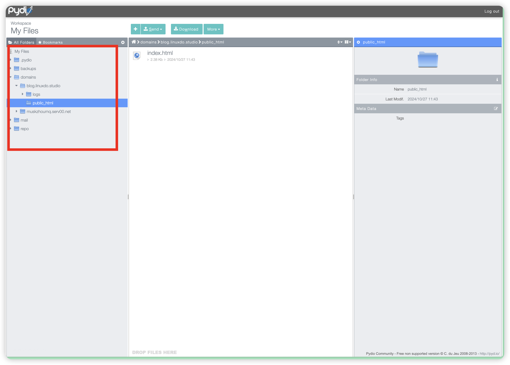
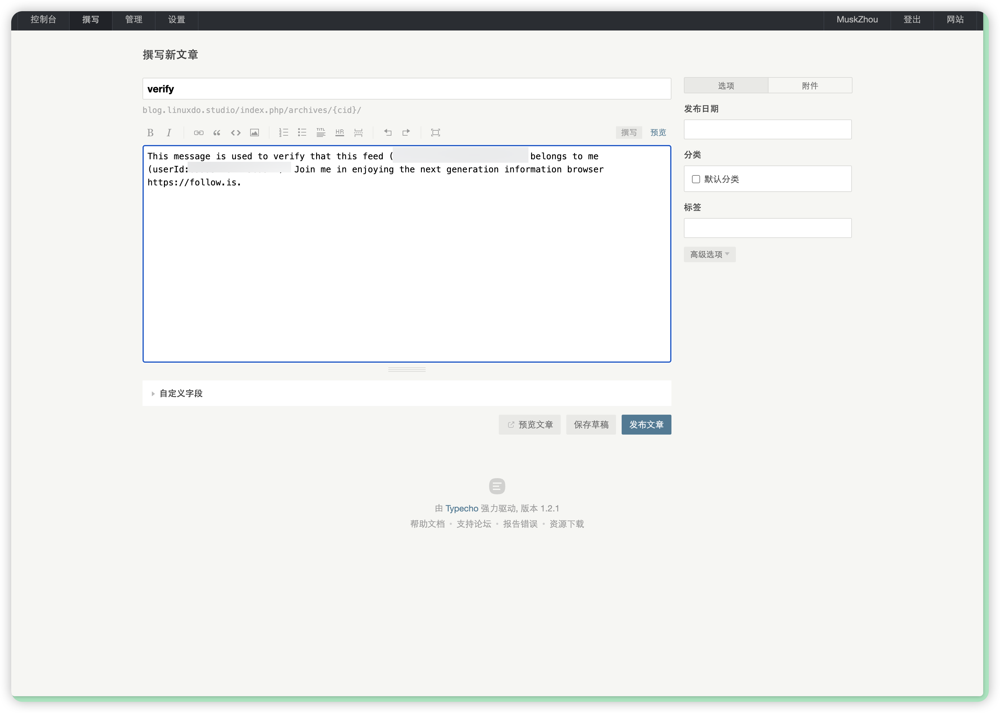

> 你需要准备的东西是：
> 
> 1. 一个serv00账号
> 2. 一点点的电脑操作能力
> 3. 一个域名

### 一、登陆serv00并添加网站（无自己域名的请直接跳转到第二步）

1. 找到左侧菜单栏的WWW websites  
   

2. 找到add new websites，并且添加你自己的域名  
   

3. 点击DNS zones并找到自己刚刚的域名，点击域名右侧的edit查看解析  
   

4. 在服务商添加解析，以cf为例  
   

---

### 二、部署Typecho主程序

1. 选择左侧栏的file manager  
   

2. 根据提示红框处选择位置  
   

3. 删除public_html下原有文件并上传压缩包  
   

4. 选择explore后全选文件解压到public_html文件夹  
   

5. 访问域名确认部署成功，如显示如下则部署成功  
   

---

### 三、部署数据库

1. 选择左侧栏mysql，并添加数据库  
   

2. 输入相应信息并记住红框信息（连前面的m前缀也要记住），点击add  
   

---

### 四、运行Typecho安装程序

1. 数据库地址填写你的serv00面板地址，例如面板是panel10.serv00.com，数据库地址是mysql10.serv00.com。如果是panel1则对应mysql1  
   

2. 正常填写其他信息并选择开始安装  
   

3. 提示创建管理员时表示部署成功，输入信息并牢记  
   

---

### 五、添加到follow并认证

1. 访问博客主页  
   

2. 右键文章rss并复制链接  
   

3. 打开follow，未部署ssl证书时需将rss链接的https改为http  
   

4. 订阅成功后右键选择认证  
   

5. 登陆Typecho后台  
   

6. 选择撰写文章  
   

7. 输入认证内容，文章名随意，选择发布文章  
   

8. 回到follow选择认证即可完成  
   

9. 认证完成后可以删除该认证文章。

